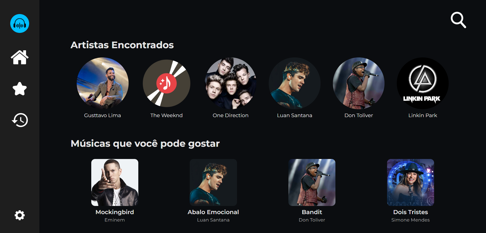
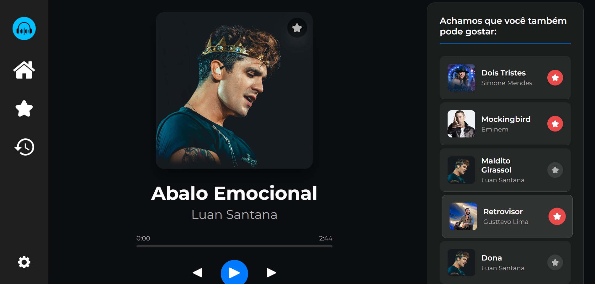
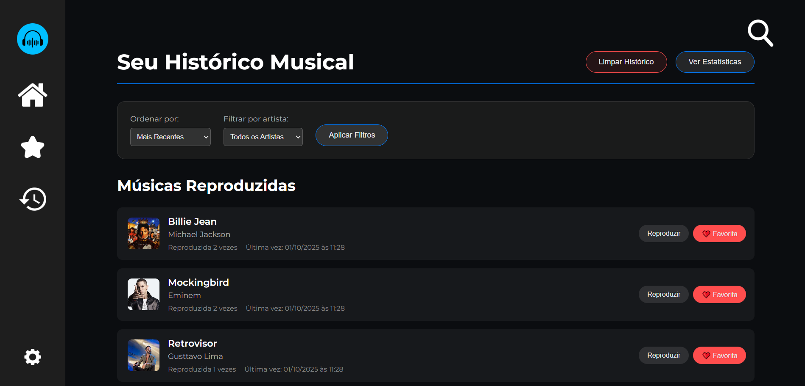
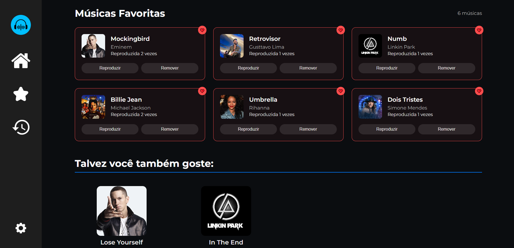

# web-music
---
Este repositório contem uma interface front-end para consumo de uma API de músicas. A API encontra-se no arquivo run.py e deve ser inicializada separadamente para a utilização da interface.

# Demonstração Visual 🔎

